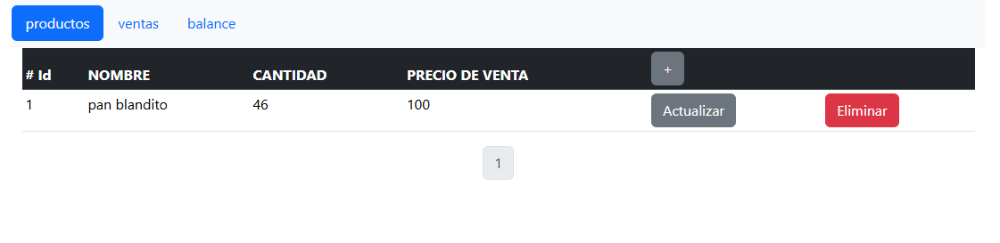

Inventario - escritorio
======================

Se trata de crear un software para el manejo de inventario en pequeñas tiendas que no cuentan con suficientes recursos. Por ende, tienen hardware viejo o de bajo costo y mucho menos pueden costear un software.

Por eso es necesario que se pueda utilizar en cualquier sistema operativo (libre o privativo) y que esté disponible para una persona con casi nulo conocimiento informático.

## Estado – En desarrollo

En el momento en que realicé la aplicación, tenía mucho tiempo y quería aventurarme con tecnologías que no conocía muy bien, aunque no eran imposibles de dominar. Por ello, me tomó mucho tiempo leer documentación para construir lo que más o menos quería. Sin embargo, por algunas cuestiones, mantener actualizado el código e ir trabajando incluso con pequeños cambios era muy complicado, y la aplicación quedó ahí, aunque espero que con *vibe coding* la cuestión fluya mejor.

## Para comenzar:

``npm start``

### ¿Por qué?

Porque muchas tiendas aún no tienen un software que facilite el manejo de inventario y no cuentan con el dinero necesario para costear uno. Un software que muestre de forma fácil y clara qué productos son los de mayor venta y cuáles están a punto de agotarse. Además, porque tengo mucho tiempo libre.

### Características:

- Multiplataforma
- Sencillo
- Libre
- Gratis
- Escalable (eso intento)

### Tecnologías

- Vue
- Vue Router
- Vuex
- Electron
- SQLite

## Funcionalidades

- CRUD de producto
- CRUD de venta

